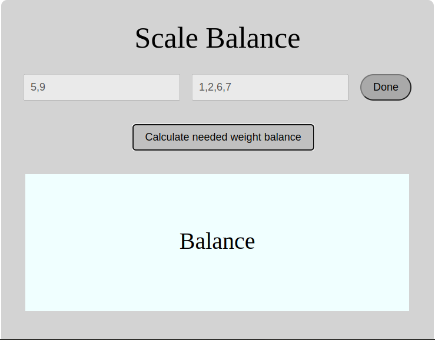

# Scale balancing project
A scale balance is made up of two elements, the first being the two positive integer weights on a balance scale (left and right sides) and the second element being a list of available weights as positive integers. The objectif is to determine if the scale can be balanced using the least amount of weights from the list, but at most 2 weights only.
## App

### Built with
- HTML
- CSS
- JavaScript
### Prerequisites
Knowledge about:
- HTML
- CSS
- JavaScript
- Google Chrome
### Clone project
Get a local copy of this project by following the steps below:
- Clone this repository using `git@github.com:Nathanael-Lontsi/scale-balance.git`
- Move to the project directory by typing : cd JavaScript and cd scale-balance in your terminal.
## Steps
- $ git clone `git@github.com:Nathanael-Lontsi/scale-balance.git`
- $ `cd scale-balance`
- $ `git checkout feature/container`
## Start up
- Run by opening index.html using the browser
: bust_in_silhouette: **Nathanael-Lontsi**
## :handshake :Contributions
We welcome contributions, issues and feature request.
Feel free to check the [issues page](https://github.com/Nathanael-Lontsi/scale-balance/issues)
## :memo :License
This project is [rebaseacademy](./LICENSE) licensed.
